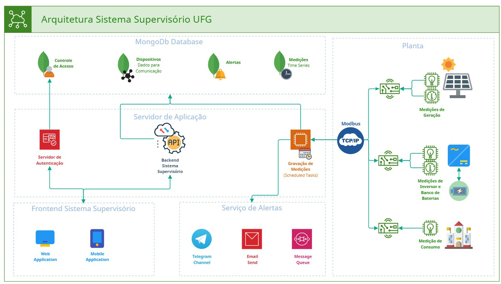

# Supervisor API

<!--- Esses são exemplos. Veja https://shields.io para outras pessoas ou para personalizar este conjunto de escudos. Você pode querer incluir dependências, estado do projeto e informações de licença aqui--->




> Sistema supervisório para monitoramento e controle da utilização de banco de baterias de Íon-Li para otimizar consumo
> e permitir controle
> de utilização energético e análise histórica de consumo.

### Ajustes e melhorias

O projeto ainda está em desenvolvimento e as próximas atualizações serão voltadas nas seguintes tarefas:

- [ ] Criação do modelo de dados
- [ ] Criação do sistema de gravação de medições
- [ ] Cadastro de fontes de dados
- [ ] Fluxo de alertas
- [ ] Controle de acesso
- [ ] Geração de relatórios
- [ ] Painel de monitoramento

## 💻 Pré-requisitos

Antes de começar, verifique se você atendeu aos seguintes requisitos:

[//]: # (* Você instalou a versão mais recente de `<linguagem / dependência / requeridos>`)

[//]: # (* Você tem uma máquina `<Windows / Linux / Mac>`. Indique qual sistema operacional é compatível / não compatível.)

[//]: # (* Você leu `<guia / link / documentação_relacionada_ao_projeto>`.)

```
Em construção.
```

## 🚀 Instalando Supervisor API

Para instalar o Supervisor API, siga estas etapas:

```
Em construção.
```

## ☕ Usando Supervisor API

Para usar Supervisor API, siga estas etapas:

```
Em construção.
```

## 📫 Contribuindo para Supervisor API

<!--— Se o seu README for longo ou se você tiver algum processo ou etapas específicas que deseja que os contribuidores sigam, considere a criação de um arquivo CONTRIBUTING.md separado--->
Para contribuir com Supervisor API, siga estas etapas:

1. Bifurque este repositório.
2. Crie um branch: `git checkout -b <nome_branch>`.
3. Faça suas alterações e confirme-as: `git commit -m '<mensagem_commit>'`
4. Envie para o branch original: `git push origin <nome_do_projeto> / <local>`
5. Crie a solicitação de pull.

Como alternativa, consulte a documentação do GitHub
em [como criar uma solicitação pull](https://help.github.com/en/github/collaborating-with-issues-and-pull-requests/creating-a-pull-request).

## 🤝 Colaboradores

Estão envolvidos neste projeto:
<div>
    <a href="https://github.com/ratacheski">
        <br>
        <sub>
            <b>Rafael Ratacheski</b>
        </sub>
    </a>
</div>

## 😄 Seja um dos contribuidores<br>

Quer fazer parte desse projeto? Clique [AQUI](CONTRIBUTING.md) e leia como contribuir.

## 📝 Licença

Esse projeto está sob licença. Veja o arquivo [LICENÇA](LICENSE.md) para mais detalhes.

[⬆ Voltar ao topo](#supervisor-api)<br>
